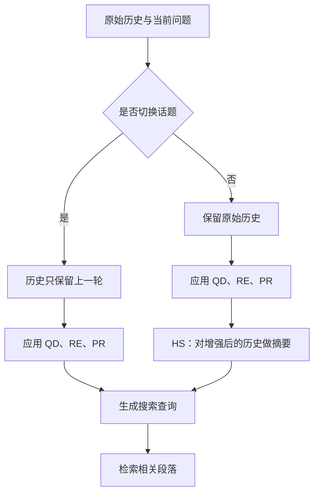

---
tags:
  - QueryRewriting
  - ConversationalSearch
  - RAG
  - Paper
source: https://aclanthology.org/2024.emnlp-main.135/
venue: EMNLP 2024
reviewed: 2026-09-27
---

# CHIQ：对话历史增强与查询改写论文笔记

论文：**CHIQ: Contextual History Enhancement for Improving Query Rewriting in Conversational Search**，Fengran Mo 等，EMNLP 2024，论文集页码 2253–2268。

[论文主页](https://aclanthology.org/2024.emnlp-main.135/) · [论文 PDF](https://aclanthology.org/2024.emnlp-main.135.pdf) · [作者代码](https://github.com/fengranMark/CHIQ)

关联：[[LLM Rewrite 资料]] · [[AI Reference/Query Rewriting：Elastic 文章笔记与检索评估指标|Elastic 查询改写笔记]] · [[AI Reference/AWS RAG Part 1：文章整理与重点理解核对|AWS RAG 笔记]]

> [!important] 核心观点
> 多轮搜索中的问题不只是“当前问题不够完整”，还可能是历史里的代词、简略回答、话题切换和噪声让模型理解出错。CHIQ 先有针对性地整理对话上下文，再生成用于检索的查询，并探索把这种能力转化成小模型的训练数据。

## 1. 概要：作者要解决什么问题

用户经常只说“那它呢”“第三个有什么影响”，默认系统记得前文。检索器却需要知道具体实体、属性及限定条件。把全部历史直接交给模型改写，等于让它一次性完成指代消解、信息补全、筛选历史与生成查询，错误容易相互传递。

作者的研究问题是：**能否把这些工作拆成较简单的 NLP 子任务，让约 7B 规模的开放模型也能生成有效的对话搜索查询？** 论文贡献主要在查询改写前的上下文处理与训练目标构造，不是提出新的 embedding 算法，也不是证明最终问答一定正确。[§1–3，PDF 第 1–4 页](https://aclanthology.org/2024.emnlp-main.135.pdf#page=1)

论文中的关键概念：

| 名称 | 含义 | 在本文的位置 |
| --- | --- | --- |
| CQR | Conversational Query Rewriting，对话查询改写 | 先生成独立查询，再交给现有检索器。 |
| CDR | Conversational Dense Retrieval，对话稠密检索 | 直接建模对话上下文进行向量检索，是相关研究路线。 |
| CHIQ | 本文提出的历史增强方法 | 先降低上下文歧义，再做 CQR。 |
| Gold passage | 标注为相关的文档段落 | 用于评估，以及离线构造训练目标。 |
| Pseudo response | 模型预测的可能回答 | 提供潜在检索词，不等于已核实答案。 |
| Pseudo supervision | 自动构造的监督目标 | 用生成且筛选过的查询训练小型改写模型。 |
| Ablation | 消融实验 | 移除某个组件，观察指标如何变化。 |

## 2. 原理：先改善上下文，再改写

### 2.1 从直接改写到两阶段处理

记历史为 `H = {(u₁,r₁), …, (uₙ,rₙ)}`，其中 u 是用户问题，r 是系统回答；当前问题为 `uₙ₊₁`。

传统直接改写可概括为：

```text
改写指令 + 原始历史 H + 当前问题 → LLM → 搜索查询 q
```

CHIQ 的思路是：

```text
原始历史 H + 当前问题
  → 指代消解、回答扩展、伪回答、话题判断、历史摘要
  → 更清楚且面向检索的上下文 H′
  → 查询改写
  → BM25 或 ANCE 检索
```

这里的“两阶段”是逻辑分工，**不代表固定两次模型调用**。不同分支和组件会带来不同调用成本；也不是“把历史写得越长越好”。[§3.1–3.3，PDF 第 3–4 页](https://aclanthology.org/2024.emnlp-main.135.pdf#page=3)

### 2.2 五种历史增强操作

| 缩写 | 操作 | 输入、输出与作用 | 主要风险 |
| --- | --- | --- | --- |
| **QD** | Question Disambiguation，问题消歧 | 结合历史补全当前问题的指代、缩写等，使它能独立理解。 | 把“它”错误绑定到其他实体。 |
| **RE** | Response Expansion，回答扩展 | 补充上一轮回答的上下文，使简短回答可独立理解。 | 把上下文补全变成无依据的事实扩写。 |
| **PR** | Pseudo Response，伪回答 | 根据历史与当前问题预测可能回答，增加可能出现在相关文档中的词。 | 将模型猜测带入查询，形成噪声。 |
| **TS** | Topic Switch，话题切换 | 判断当前问题是否切换话题；切换时按本文策略只保留上一轮历史作为过渡。 | 误删仍有用的较早限定条件。 |
| **HS** | History Summary，历史摘要 | 将历史压缩成保留关键信息的文本，减少冗余。 | 漏掉否定、比较对象和细小但必要的条件。 |

**RE 与 PR 的对象不同：RE 整理上一轮已有回答，PR 预测当前轮尚未检索验证的回答。** 这是理解方法时最容易混淆的地方。[§3.2，PDF 第 3–4 页](https://aclanthology.org/2024.emnlp-main.135.pdf#page=3)

### 2.3 默认组合不是简单把五种输出全拼起来

按 §3.3 的描述，默认先判断 TS：



在此组合中，QD 保留当前原问题并附加消歧版本；RE 替换上一轮回答；PR 为查询生成增加预测信息。检测到话题切换的分支不启用 HS。以上描述的是论文默认方法，不代表所有业务都应该只保留最近一轮。[§3.3，PDF 第 4 页](https://aclanthology.org/2024.emnlp-main.135.pdf#page=4)

### 2.4 用一个自拟例子理解

```text
用户：A17 电机有哪些常见故障？
系统：轴承磨损、绕组过热、绝缘老化。
用户：第二个应该怎么排查？
```

- QD：把“第二个”解析为“绕组过热”，明确问题为“A17 电机绕组过热如何排查”。
- RE：把上一轮列表补成“A17 电机的常见故障包括……”，补上列表所属实体。
- PR：模型可能提出“负载、电流、散热、温升”等方向，作为检索线索；这些不是已经核实的诊断结论。
- TS：本轮仍延续电机故障主题，无需因为问法变化就删掉历史。
- HS：历史较长时保留设备型号与故障主题，压缩无关闲聊。

其原理是同时改善两件事：**对齐用户意图**，以及**增加与相关文档匹配的表达**。前者要求忠实保留已知条件，后者可能引入预测内容，两者的可信程度不同。实际应用中应区分“历史中已知的信息”和“模型推测的词”。这是本笔记的工程解读，不是论文额外验证过的机制。

## 3. 三种使用方式：AD、FT、Fusion

| 方案 | 怎么做 | 在线成本与适用权衡 |
| --- | --- | --- |
| **CHIQ-AD** | 在线增强上下文，由 LLM 生成查询，再检索。 | 无需先训练专用改写模型，但在线依赖 LLM。 |
| **CHIQ-FT** | 离线生成和筛选查询训练目标，微调 FlanT5；线上用小模型改写。 | 需要训练数据及相关文档标注；在线不再调用增强用的大模型。 |
| **CHIQ-Fusion** | AD 和 FT 各自检索，再融合两个结果列表。 | 利用两者互补性，但同时承担两条分支的开销。 |

Fusion 是**结果级融合**，不是拼接查询，也不是融合两套模型参数。附录 B.2 给出平衡系数 α = 1；不要未经核验就把它等同于前面 Elastic 文章的 RRF 配置。[§4.2，PDF 第 5 页](https://aclanthology.org/2024.emnlp-main.135.pdf#page=5)、[附录 B.2，PDF 第 14 页](https://aclanthology.org/2024.emnlp-main.135.pdf#page=14)

### 3.1 FT 为什么叫“面向搜索的微调”

人类写得自然的完整问题，不一定能让指定检索器找到正确段落。FT 因此根据检索效果选择训练目标，而不只模仿人工改写的措辞。

离线过程：

1. 为训练对话生成增强历史。
2. 将历史、当前问题及 **gold passage** 提供给 LLM，一次生成多个候选查询。
3. 用检索器和相关性标注评价候选；附录 B.2 明确使用 **NDCG@3** 作为选择标准。
4. 选表现最好的候选作为伪标签。
5. 通过最大似然训练小型查询改写模型。

用简化符号表达选择过程：

$$
q^* = \arg\max_{q\in Q} NDCG@3(\operatorname{Retrieve}(q),\operatorname{qrels})
$$

这属于对论文公式 2、3 的解释性重写：`Q` 是候选查询集合，`qrels` 是相关性标注；优化的是候选所产生的排名质量，不是改写与某条人工句子的字面相似度。[§3.4，PDF 第 4–5 页](https://aclanthology.org/2024.emnlp-main.135.pdf#page=4)

> [!important] 训练与推理的边界
> Gold passage 只用于离线生成训练目标和评估。线上 CHIQ-FT 接收原始历史与当前问题，不需要事先获得正确段落，也不调用大模型做历史增强。因而“没有人工改写标签”不等于“没有任何监督”：该训练方案仍依赖相关段落及相关性标注。

复现注意：§3.4 训练公式写入的是 H′，紧接着推理说明写的是 H。论文明确了线上不用 LLM，但训练输入的具体组织仍应结合数据处理代码核对，不能擅自将全部流程简化成“训练、推理都用增强历史”。[PDF 第 4–5 页](https://aclanthology.org/2024.emnlp-main.135.pdf#page=4)

## 4. 实验说明了什么

### 4.1 实验对象与评估口径

| 项目 | 配置与用途 |
| --- | --- |
| TopiOCQA | 多轮开放域问答，重点包含话题切换；论文用其训练／测试划分。 |
| QReCC | 对话问答与查询改写数据；论文用其训练／测试划分。 |
| CAsT-19 / 20 / 21 | TREC Conversational Assistance Track 的三个评测集，用于目标数据上的零样本／迁移评估。 |
| 大模型 | 主结果使用 LLaMA-2-7B；另测 Mistral-7B-Instruct-v0.2，并在部分比较中使用 ChatGPT-3.5。 |
| 改写小模型 | 主要为 FlanT5-base，另涉及 large 版本。 |
| 检索器 | BM25：词法／稀疏检索；ANCE：稠密向量检索。 |
| 指标 | MRR、NDCG@3、Recall@10；分数越高越好。 |

五个 benchmark 是两个主数据集加三个 CAsT 年份，不能误读为五种语言。CAsT 上“zero-shot”意味着未用该目标数据集训练，不意味着 FT 模型从未在其他数据上训练。[§4，PDF 第 5 页](https://aclanthology.org/2024.emnlp-main.135.pdf#page=5)

指标通常在 `[0,1]`，论文表格以乘 100 后的形式展示：例如 MRR 33.2 对应 0.332。MRR 看首个相关结果的名次；NDCG@3 看前三名的相关性与顺序；Recall@10 看相关段落进入前十的比例。NDCG@3 与此前笔记中的 NDCG@10 原理相同，截断位置不同。

作者代码的评估函数明确将均值乘以 100；NDCG 使用多等级标注，MRR／Recall 的相关与否则按阈值转换。参见 [enhancement_generation.py 中的评估函数](https://github.com/fengranMark/CHIQ/blob/main/generation/enhancement_generation.py)；指标原理详见 [[AI Reference/Query Rewriting：Elastic 文章笔记与检索评估指标#5. 评估指标：区间、用途、公式和例子|检索评估指标]]。

### 4.2 主结果：有提升，但不是每项都最佳

以下选取 Table 1 的 ANCE 稠密检索结果，保留原表的百分制口径。不是全部基线清单。

| 方法 | TopiOCQA MRR | NDCG@3 | Recall@10 | QReCC MRR | NDCG@3 | Recall@10 |
| --- | ---: | ---: | ---: | ---: | ---: | ---: |
| T5QR | 23.0 | 22.2 | 37.6 | 34.5 | 31.8 | 53.1 |
| LLM4CS（LLaMA-2-7B） | 27.7 | 26.7 | 43.3 | 44.8 | 42.1 | 66.4 |
| CHIQ-FT | 30.0 | 28.9 | 51.0 | 36.9 | 34.0 | 57.6 |
| CHIQ-AD | 33.2 | 32.2 | 53.0 | 47.0 | 44.6 | 70.8 |
| CHIQ-Fusion | 38.0 | 37.0 | 61.6 | 47.2 | 44.2 | 70.7 |

解读：

- TopiOCQA 上 Fusion 的优势明显，符合话题复杂时上下文处理更重要的解释。
- QReCC 上 Fusion 的 MRR 略高，但 NDCG@3、Recall@10 略低于 AD，不能说融合必然全指标获胜。
- FT 比 T5QR 更好，不等于 FT 比所有其他方案都好；例如 QReCC 的 FT 明显落后于 AD。
- `27.7 → 33.2` 是增加 **5.5 个点**，相对提升约 **19.9%**。原文有时用 `%` 描述差值，阅读时应根据表格区分绝对与相对增幅。

在 BM25 设置下，TopiOCQA 的 MRR 为 LLM4CS 18.9、AD 22.5、Fusion 25.6；QReCC 分别为 47.8、53.1、54.3。这说明收益也出现在词法检索中。[Table 1，PDF 第 6 页](https://aclanthology.org/2024.emnlp-main.135.pdf#page=6)

### 4.3 开放模型与闭源模型：结论要限定

Table 2 中，CAsT-20 的 MRR：CHIQ-Fusion 为 54.0，使用 ChatGPT-3.5 的 LLM4CS 为 58.6；CAsT-21 对应为 62.9 与 66.1。因此论文支持“开放模型具有竞争力、在多种设置获得提升”，不支持“开放模型全面超过闭源模型”。[Table 2](https://aclanthology.org/2024.emnlp-main.135.pdf#page=6)

更直接检验历史增强的是 Table 3：同样的 LLaMA，CAsT-20 的 MRR 从原历史的 40.9 升至增强历史的 51.0；同样的 ChatGPT 则从 53.0 升至 55.7。由此可见，历史增强并不只对较弱模型有意义。[Table 3，PDF 第 7 页](https://aclanthology.org/2024.emnlp-main.135.pdf#page=7)

这些是 2024 年论文中的具体模型及实验，不能当作今天所有开放／闭源模型的能力排名。

### 4.4 消融实验：哪些机制影响较大

Table 5 的 TopiOCQA + ANCE 设置：

| 设置 | MRR | 与完整 AD 的差值 |
| --- | ---: | ---: |
| 完整 CHIQ-AD | 33.2 | — |
| 移除 QD | 32.5 | −0.7 |
| 移除 RE | 28.3 | −4.9 |
| 移除 PR | 26.4 | −6.8 |
| 移除 TS（连同 HS） | 20.0 | −13.2 |

**重要限定：论文说明 HS 随 TS 一起消融。** 所以最后一行不能严格解释为“仅 TS 的独立收益为 13.2 点”；它涉及一组联动机制。在 QReCC 上对应变化远小于 TopiOCQA，也说明组件收益与数据中的话题切换情况有关。[§5.5 与 Table 5，PDF 第 8 页](https://aclanthology.org/2024.emnlp-main.135.pdf#page=8)

Table 4 的 FT 消融同样值得看：TopiOCQA MRR 完整方案为 30.0；不使用增强历史为 27.6，不生成多个候选为 24.2，不以 gold passage 为条件为 18.2。这里最直接的教训是训练目标的质量很重要，不能把 FT 的效果全部归因于历史消歧。[§5.4 与 Table 4](https://aclanthology.org/2024.emnlp-main.135.pdf#page=8)

统计注记：Table 1 的 † 表示指定比较下 t-test 的 p < 0.05，并明确排除部分基线；它不是对所有行、所有模型的无条件显著性保证。消融差值也不能简单相加，组件可能互相依赖。

## 5. 重要段落标注与精读路线

下面的“标注”给出 **章节、具体段落位置、重要原因和可点击页码**。PDF 页码从封面正文第一页算起；论文集页码 = PDF 页码 + 2252。这里是在笔记中标注阅读位置，未修改原始 PDF。

| 优先级 | 重要位置 | PDF 页 / 论文页 | 阅读时要抓住的问题 |
| --- | --- | --- | --- |
| **必读 1** | §1 第 2、3 段：从历史歧义引出方法 | [1 / 2253](https://aclanthology.org/2024.emnlp-main.135.pdf#page=1) | 为什么不能只给模型一句“请改写当前问题”？ |
| **必读 2** | §3.1 公式 1 及其后的 H′ 说明 | [3 / 2255](https://aclanthology.org/2024.emnlp-main.135.pdf#page=3) | 输入、输出是什么，历史增强插在什么位置？ |
| **必读 3** | §3.2.1–3.2.5，各方法定义段 | [3–4 / 2255–2256](https://aclanthology.org/2024.emnlp-main.135.pdf#page=3) | 五个组件分别改变哪部分上下文？特别区分 RE 与 PR。 |
| **必读 4** | §3.3 最后一段，默认配置说明 | [4 / 2256](https://aclanthology.org/2024.emnlp-main.135.pdf#page=4) | TS 如何决定是否截断历史、是否启用 HS？ |
| **必读 5** | §3.4 公式 2、3，以及跨页的最后一段 | [4–5 / 2256–2257](https://aclanthology.org/2024.emnlp-main.135.pdf#page=4) | Gold passage、多个候选、检索评分各起什么作用？为什么线上不需要答案？ |
| **必读 6** | Table 1、Table 2 及表注；§5.1–5.2 分析 | [6–7 / 2258–2259](https://aclanthology.org/2024.emnlp-main.135.pdf#page=6) | 哪些指标改善、哪些没有？闭源对比的例外是什么？ |
| **必读 7** | §5.4、§5.5 和 Table 4、5 | [8 / 2260](https://aclanthology.org/2024.emnlp-main.135.pdf#page=8) | 方法有效的证据来自哪些组件？消融是否真的独立？ |
| **必读 8** | §5.6 跨页段落与 Limitations | [8–9 / 2260–2261](https://aclanthology.org/2024.emnlp-main.135.pdf#page=8) | 幻觉词、模型范围和错误回退有哪些限制？ |
| **实现必读** | Appendix A.1–A.7 | [13 / 2265](https://aclanthology.org/2024.emnlp-main.135.pdf#page=13) | 各子任务输出怎样受约束？同时留意 A.2/A.3 疑似对调。 |
| **复现必读** | Appendix B.2，跨页的实现参数段 | [13–14 / 2265–2266](https://aclanthology.org/2024.emnlp-main.135.pdf#page=13) | 候选按什么指标选？截断长度、采样和融合权重是什么？ |
| 进一步阅读 | Appendix C，Table 7、8 及其分析 | [14–15 / 2266–2267](https://aclanthology.org/2024.emnlp-main.135.pdf#page=14) | 换模型后，融合是否仍然有效？ |
| 审慎阅读 | Appendix D，Table 9、10 | [15–16 / 2267–2268](https://aclanthology.org/2024.emnlp-main.135.pdf#page=15) | 排名提升能否由展示的上下文支持？Table 10 有内容错位疑点。 |

时间有限时，优先按 **§3.2 → §3.3 → §3.4 → Table 1 → Table 4/5 → Limitations** 阅读；需要复现再看 Appendix A/B。

## 6. 提示词设计：这篇论文值得借鉴什么

Appendix A 把一个复杂改写任务拆成职责明确的提示词：消歧只输出清楚的问题，话题判断输出固定标签，摘要保留问答信息，最终改写输出查询字段，训练数据生成则输出多个候选。[Appendix A](https://aclanthology.org/2024.emnlp-main.135.pdf#page=13)

对现有 Rewrite 学习的补充是：**模板不仅能约束最终输出，还能规定中间上下文处理任务。** 可以分别检查每一步是否改变用户意图，而不是只检查最终 JSON 能否解析。

以下为自拟的简化消歧模板，不是论文原文，也未进行实验验证：

```text
输入：对话历史、当前问题。
任务：补全当前问题中可由历史唯一确定的实体、指代和限定条件。
要求：
- 保留用户的问题意图、否定条件、时间和比较对象。
- 不把猜测的答案写成已知事实。
- 无法唯一确定指代时，保留歧义并列出待澄清对象。
输出：{"standalone_query": "...", "unresolved_references": []}
```

这个模板只覆盖 QD，并不等于完整 CHIQ；PR、TS、HS 的引入应单独评估收益与错误传播。

## 7. 原文疑点、限制与阅读边界

### 7.1 Appendix A.2 / A.3 的内容疑似对调

PDF 第 13 页的 A.2 标题是回答扩展，内容却要求对新问题生成回答；A.3 标题是伪回答，内容却要求把已有不清楚的回答展开。与 §3.2 的定义相比，两者语义相反。

作者仓库的提示词字典也把“回答新问题”命名为 `single_response`，把“展开已有回答”命名为 `explain_response`。因此本笔记按正文定义解释 RE／PR，附录作为待核验提示词来源，而不照标题直接套用。[PDF 第 13 页](https://aclanthology.org/2024.emnlp-main.135.pdf#page=13)、[作者提示词代码](https://github.com/fengranMark/CHIQ/blob/main/generation/enhancement_generation.py)

### 7.2 Table 10 的案例内容不一致

PDF 第 16 页左侧是 Cal Tjader 的音乐对话，右侧增强历史却谈 Kenneth Anger、Stan Brakhage 的电影；正文还把电影标题描述成与该音乐案例相关的词。该内容在 PDF 页面中确实如此，并非文本抽取导致。

可以记录表中报告的排名，但不能把这幅表当作“正确增强原历史”的清晰机制证明。它可能涉及排版、样例对应错误或生成偏题；仅凭论文无法确定原因。[Table 10](https://aclanthology.org/2024.emnlp-main.135.pdf#page=16)

### 7.3 效果与成本的适用边界

- PR／RE 可能生成错误事实；检索分数提升不自动证明增强历史真实。
- 论文未覆盖所有模型、所有语言和业务域；尤其不能把结果外推到今天的大模型比较。
- AD 的多阶段调用与 Fusion 的两路检索都有成本；FT 减少在线 LLM 调用，不等于论文已给出可直接套用的生产延迟结论。
- 本文主要评估段落检索，没有据此证明最终 RAG 答案的真实性、完整性或业务成功率。
- TopiOCQA 与 QReCC 的话题结构不同，组件收益也不同；不宜将全套增强当作所有查询的固定必经步骤。

此外，Table 3 中 ChatGPT 的 CAsT-19 NDCG@3 是 `40.8 → 46.4`，表格差值为 **5.6 个点**，正文写作 5.4；本笔记以表格数值为准，并保留这一差异供复现核对。[Table 3 与 §5.3](https://aclanthology.org/2024.emnlp-main.135.pdf#page=7)

## 8. 与已有两篇笔记的关系

| 笔记 | 主要解决的问题 |
| --- | --- |
| Elastic | 生成内容怎样通过受控模板参与检索评分。 |
| AWS RAG | 从切分、索引、检索到生成，如何定位和修复质量问题。 |
| CHIQ | 多轮对话中，怎样先理解和整理上下文，再生成检索查询；以及怎样离线训练较小的改写模型。 |

可将 CHIQ 理解为查询处理前段的一种方法：先解决“用户这一轮到底在问什么”，再选择检索表达和执行方式。其最值得迁移的思想是明确区分 **历史事实、指代解析、预测性扩展与检索执行**，并用消融实验判断每一步是否真的有帮助。
