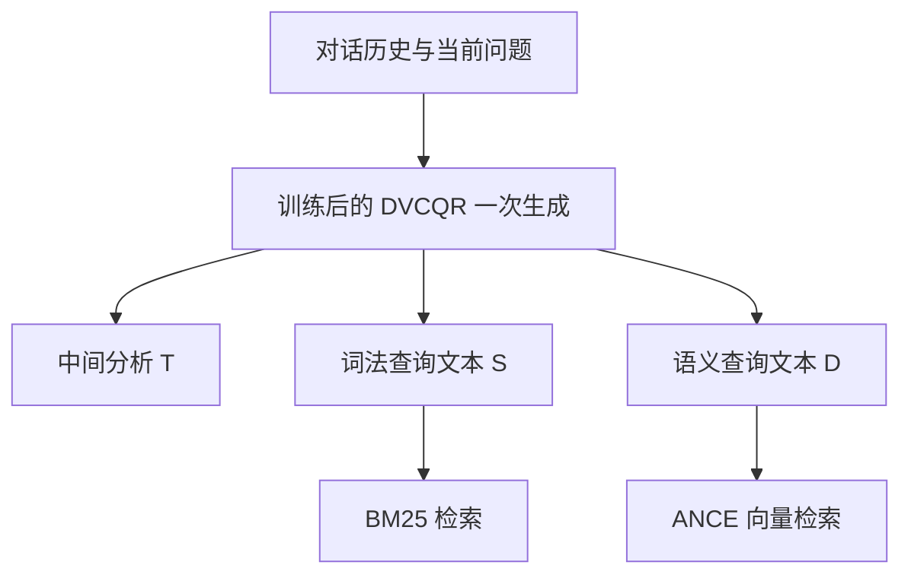

---
tags:
  - QueryRewriting
  - ConversationalSearch
  - ReinforcementLearning
  - Paper
source: https://aclanthology.org/2026.acl-long.1054/
venue: ACL 2026
reviewed: 2026-09-27
---

# DVCQR：双视图查询改写与分阶段强化学习论文笔记

论文：**DVCQR: Dual-View Conversational Query Rewriting with Stage-wise Reinforcement Learning**，Chenyi Li、Xinhui Tu、Zaixiang Wang，ACL 2026，论文集页码 22993–23014，共 22 页。

[论文主页](https://aclanthology.org/2026.acl-long.1054/) · [论文 PDF](https://aclanthology.org/2026.acl-long.1054.pdf)

关联：[[LLM Rewrite 资料]] · [[AI Reference/CHIQ：对话历史增强与查询改写论文笔记|CHIQ 论文笔记]] · [[AI Reference/Query Rewriting：Elastic 文章笔记与检索评估指标|Elastic 改写与指标笔记]] · [[AI Reference/AWS RAG Part 1：文章整理与重点理解核对|AWS RAG 笔记]]

> [!important] 核心观点
> 一条改写查询可能难以同时满足词法检索与向量检索的偏好。DVCQR 用同一个模型，一次生成两种职责明确的查询，再通过先词法、后语义的强化学习训练，使它们分别适应对应检索器。它同时拆分了“输出形式”和“训练目标”。

## 1. 概要：论文想表达什么

多轮对话查询经常省略实体、使用代词，改写器需要恢复完整意图。但“意图完整”还不够：查询送入哪种检索器，也会影响什么形式更有效。

作者提出两种困难：

1. **查询形式的冲突**：BM25 依赖词项匹配，往往受益于明确的实体、属性和有区分度的词；ANCE 等向量检索器需要清楚表达实体之间的关系、时间、地点等语义条件。同一段长改写可能有利于一边，却给另一边带入噪声。
2. **训练目标的冲突**：如果把两种检索器的奖励合成一个数字，同时训练一条改写，某些更新可能使词法效果变好、向量效果变差，合计奖励变化很小。

DVCQR 的解决方式是：**分别输出 S、D 两种文本，同时分阶段使用对应检索反馈训练。** 这是一种查询侧的适配方法，主要训练改写器；不是重新发明 BM25 或 embedding 模型，也不是完整的 RAG 回答生成框架。[§1，PDF 第 1–2 页](https://aclanthology.org/2026.acl-long.1054.pdf#page=1)

上述“偏好”是论文的方法动机与实验观察，不是“BM25 只能接受关键词、向量只能接受自然句子”的硬性规则。

### 各章节阅读地图

| 位置 | 要回答的问题 |
| --- | --- |
| §1 引言 | 为什么同一条改写、同一个联合奖励可能产生矛盾？ |
| §2 相关工作 | 与传统 CQR、检索器对齐和 RLVR 的关系是什么？ |
| §3.1–3.3 | 双视图是什么？一次生成哪些内容？ |
| §3.4–3.6 | SFT 预热、词法 RL、语义 RL 各做什么？ |
| §3.7 | GSPO 怎样把检索奖励转成模型更新？ |
| §4.1–4.3 | 用哪些模型和数据集验证，提升出现在哪里？ |
| §4.4–4.6 | 各训练阶段是否有帮助？联合奖励冲突如何观察？ |
| §4.7、§5 与 Limitations | 案例能解释什么，方法的适用边界是什么？ |
| 附录 A–D | 与其他路线的区别、训练数据筛选、格式奖励和复现参数。 |
| 附录 E–I | 换检索器、奖励分析、JointRL 对照、效率测试。 |
| Table 11–15、Figure 5 | 完整提示词、训练轨迹和案例。 |

## 2. 双视图原理：同一意图，两种检索表达

输入是历史对话 C 和当前问题 q；输出用论文符号表示为：

$$
(T,S,D)\leftarrow DVCQR(C,q)
$$

| 输出 | 含义 | 如何使用 |
| --- | --- | --- |
| T | 论文训练模型生成的中间推理文本 | 协调实体、指代和查询意图；不是交给检索器的最终查询。 |
| S | Sparse-view rewrite，词法检索视图 | 关键词式文本，突出实体名、属性词及必要限定，交给 BM25。 |
| D | Dense-view rewrite，向量检索视图 | 独立自然语言查询，并拼接简短的预测回答，交给 ANCE 编码检索。 |

**S 和 D 都是文本，不是稀疏向量和稠密向量。** “Sparse / Dense”指下游用途。原文结构使用 `<thinking>`、`<sparse>`、`<dense>` 标签；这些是该论文模型的输出约定，不代表标签本身就会提高检索质量。[§3.1–3.3，PDF 第 3 页](https://aclanthology.org/2026.acl-long.1054.pdf#page=3)

### 2.1 为什么 D 还带一个预测回答

答案式文本可能更接近文档的措辞，增加语义匹配线索。因此 D 不只是将代词换成实体后的一句问句，而是“改写问题 + 简短的可能回答”。但预测回答仍来自模型知识，不是检索后的证据，也不能直接当作已验证答案。

自拟示例：

```text
历史：用户正在了解 PostgreSQL 数据库的事务机制。
当前问题：它怎么避免读到没提交的数据？

S：PostgreSQL transaction isolation dirty read uncommitted data MVCC
D：How does PostgreSQL prevent a transaction from reading uncommitted data?
   Relevant mechanisms include transaction isolation and MVCC visibility rules.
```

S 保留便于命中的词项；D 明确表达“数据库—事务—未提交数据—可见性”的关系。例子只演示表达形式，不是论文样例或可直接部署的改写策略。

### 2.2 一次生成、分别使用，不等于结果融合



这里的“一次生成”是一次模型调用生成整份输出，不是同时独立生成、也不是只解码一个 token。论文主要分别报告 BM25 与 ANCE 的效果；它适合两种检索器共存的系统，但主结果不能直接当作“融合后结果”的成绩。若线上还要融合两个候选列表，需要另外确定融合与重排策略。

## 3. 三阶段训练：训练顺序与线上过程分开看


### 3.1 Stage I：监督预热与教师蒸馏

教师模型采用 DeepSeek-V3.2-Exp，根据对话、当前问题与自身知识生成 T、S、D。随后实际检索，仅保留满足两个条件的训练样本：格式正确；gold passage 在 S 对应的稀疏检索与 D 对应的稠密检索中均排第一。

再用这些高质量输出监督微调学生改写器，得到 `π_SFT`。论文采用 Qwen2.5-3B-Instruct 与 Qwen3-4B-Instruct-2507 作为学生骨干。筛选后 SFT 数据量为 TopiOCQA 12,987 条、QReCC 8,985 条。[§3.4](https://aclanthology.org/2026.acl-long.1054.pdf#page=3)、[附录 B / Table 5](https://aclanthology.org/2026.acl-long.1054.pdf#page=13)

其作用可以理解为：先让学生学会正确任务结构及基本可用的改写，再由 RL 优化检索效果。它没有证明“任何随机初始化模型都无法直接 RL”，而是给出本方案的训练设计。

> [!important] 与 CHIQ-FT 的差别
> CHIQ-FT 将 gold passage 提供给教师，辅助生成训练候选；DVCQR 的教师提示词只提供对话、问题与世界知识，gold passage 用在生成后的筛选和训练奖励计算中。两者都需要相关性监督，但监督进入流水线的位置不同。

### 3.2 Stage II：以词法检索反馈优化

从 `π_SFT` 开始，模型生成候选输出，将 S 交给 BM25，用相关段落的名次与关键词覆盖度算奖励，通过 GSPO 更新成 `π_S`。

强化学习关心的不是“关键词看起来丰富”，而是这些词能否让相关文档排得更靠前。辅助关键词奖励用于补充更细的学习信号，尤其是在相关文档没进前 100、主奖励为零时。

### 3.3 Stage III：以向量检索反馈继续优化

从 `π_S` 继续训练，将 D 交给 ANCE，使用排名奖励和语义相似度奖励，得到最终模型 `π_D`。两个阶段使用的是同一个改写模型，论文没有提出两个互不共享参数的独立分支。[§3.5–3.7，PDF 第 3–5 页](https://aclanthology.org/2026.acl-long.1054.pdf#page=3)

**按阶段使用一类检索反馈，不等于冻结另一种输出的所有能力。** 共享参数会产生跨视图影响，论文也观察到 Stage II 会改善 ANCE，Stage III 前期会改善 BM25、后期可能使 BM25 略回退。

### 3.4 线上不重复训练阶段

部署时只用最终模型根据对话生成 T、S、D，再分别执行检索。教师模型、gold passage、奖励计算和 GSPO 属于训练流程，不是每次用户提问都必需的步骤。

因此本方法是“无需人工逐条写出改写答案”这一类学习方式，**不能表述成完全无监督**：SFT 筛选和 RL 依赖 gold passage，关键词奖励还使用真实主题／章节标注。

## 4. 奖励函数：训练究竟在鼓励什么

### 4.1 排名奖励 R_rank

设 r 为 gold passage 在当前检索器返回结果中的名次，原文公式 2 为：

$$
R_{rank}(r)=
\begin{cases}
1-0.5\left(\frac{r-1}{9}\right)^{0.7}, & 1\le r\le10\\
0.5\left(\frac{100-r}{90}\right)^{1.3}, & 10<r\le100\\
0, & r>100
\end{cases}
$$

| 位置 | 奖励 | 作用 |
| --- | ---: | --- |
| 第 1 名 | 1 | 最理想。 |
| 第 10 名 | 0.5 | 进入第一页仍有较强奖励。 |
| 第 50 名 | 约 0.233 | 已检出但排名不佳，仍保留学习信号。 |
| 第 100 名 | 0 | 根据公式，边界恰好为零。 |
| 前 100 未找到 | 0 | 主奖励不提供正向反馈。 |

这是 `[0,1]` 的自定义训练奖励，**不是 MRR、NDCG 或 BM25 原始分数**。正文对较低排名的概括不能覆盖第 100 名这个零值边界，阅读时以公式为准。[公式 2，PDF 第 4 页](https://aclanthology.org/2026.acl-long.1054.pdf#page=4)

### 4.2 关键词覆盖奖励 R_k

从真实 topic 与 topic section 标注提取实体词集合 E、方面词集合 A，再看 S 覆盖多少：

$$
R_k=0.5\frac{|S\cap E|}{|E|}+0.5\frac{|S\cap A|}{|A|}
$$

S 在该公式中按匹配词项理解，奖励范围通常为 `[0,1]`。两部分等权，分别约束“在找哪个对象”和“在问对象的什么属性”。实现还需约定分词、归一化、词项匹配和空集合处理；不能直接对原始字符串做数学集合运算。论文未在这个公式中完整说明这些边界细节。[公式 3](https://aclanthology.org/2026.acl-long.1054.pdf#page=4)

### 4.3 语义相似度奖励 R_s

用 ANCE 编码并归一化 D 与相关段落，取非负余弦相似度：

$$
R_s=\max(0,\cos(D',G'))
$$

原始余弦范围为 `[-1,1]`，经过截断后为 `[0,1]`。它衡量查询与相关段落的表征接近程度；不像排名奖励那样显式考虑它相对于其他候选文档的位置。[公式 5](https://aclanthology.org/2026.acl-long.1054.pdf#page=4)、[附录 D.4](https://aclanthology.org/2026.acl-long.1054.pdf#page=14)

### 4.4 总奖励与格式约束

附录 D.4 给出的权重是 0.9 与 0.1：

$$
R^{(s)}=0.9R_{rank}(r_s)+0.1R_k
$$

$$
R^{(d)}=0.9R_{rank}(r_d)+0.1R_s
$$

格式检查是一个**硬性前置条件**：格式不正确时总奖励直接设为零，并跳过后续奖励评估；格式正确时才使用对应阶段奖励。这里不是在总奖励中再加 1。附录 C 提到的极小格式奖励权重仅用于日志监控，不能与主要优化目标混淆。[附录 C，公式 8](https://aclanthology.org/2026.acl-long.1054.pdf#page=13)

在忽略日志用的近零项时，两阶段总奖励都在 `[0,1]`。主奖励为零时，辅助项仍可能给出最多 0.1 的总奖励。

## 5. GSPO 原理：如何利用检索奖励训练模型

GSPO = **Group Sequence Policy Optimization**，组序列策略优化。理解本文不必先推导完整梯度，但应知道下面四个环节。[§3.7，PDF 第 5 页](https://aclanthology.org/2026.acl-long.1054.pdf#page=5)

1. **同题采样一组候选**：对同一输入生成多个完整输出，本文每组为 6 个。
2. **组内比较**：各候选经检索获得奖励，再减去组内平均值、除以标准差，形成优势值。高于同组平均奖励的候选获得正优势，低于平均的获得负优势。
3. **控制更新幅度**：根据新旧策略生成完整序列的概率比，计算按长度归一化的序列重要性比，并进行裁剪。相比逐 token 比率，GSPO 在序列层面处理这一更新权重。
4. **限制策略偏移**：KL 正则约束新模型不要过快偏离参考模型。Stage II 的参考为 `π_SFT`，Stage III 的参考换为 `π_S`。

优势值的简化表示：

$$
\hat A_i=\frac{R_i-\operatorname{mean}(R_1,\ldots,R_G)}{\operatorname{std}(R_1,\ldots,R_G)}
$$

它不在 `[0,1]`，正负表示相对同组其他候选的好坏。实际实现要处理全组奖励相同导致标准差为零的情况。

例如奖励为 `0.8、0.4、0.2`，模型被鼓励提高第一种输出的生成概率，并降低较差输出的相对概率。这个三候选例子仅用于解释；论文实际使用 6 个候选。

论文记录 RL 的 β = 0.001、学习率 `3×10⁻⁶`，采样温度 0.7；这些是复现参数，不是所有查询改写任务的通用最优配置。[附录 D.4](https://aclanthology.org/2026.acl-long.1054.pdf#page=14)

## 6. 为什么要分阶段：证据与解释的区别

### 6.1 作者如何观察联合奖励冲突

JointRL 把词法与向量排名奖励在一个训练阶段加权合成。作者观察相邻日志点：如果两个奖励变化方向相反，且合计奖励变化小，就把它视为局部冲突／抵消。

$$
\rho(t)=\frac{|\Delta R(t)|}{|\Delta R_{sparse}(t)|+|\Delta R_{dense}(t)|+\epsilon}
$$

ρ 越小，表示合计变化相对于分项变化越小。本文单查询 JointRL 的实验在 1–5620 步中识别出 16 个抵消区间，共 1480 步，约 26.3%；区间内平均 ρ 约 0.13。[§4.5、Figure 3](https://aclanthology.org/2026.acl-long.1054.pdf#page=7)、[附录 G](https://aclanthology.org/2026.acl-long.1054.pdf#page=15)

**阅读边界：这是训练奖励轨迹上的诊断，不是直接测量梯度夹角，也不是联合优化必然失败的数学证明。** 其他联合权重、优化器或任务可能表现不同。

### 6.2 拆输出与拆训练分别带来了什么

Table 9 在 TopiOCQA 上给出同为 Qwen2.5-3B 的对照：

| 设置 | BM25 MRR | ANCE MRR |
| --- | ---: | ---: |
| 单改写 + JointRL | 21.1 | 33.1 |
| 双视图 + JointRL | 34.4 | 47.0 |
| ConvSearch-R1 | 35.2 | 51.4 |
| 双视图 + 分阶段 RL（DVCQR） | **37.4** | **52.5** |

它支持两点：先拆开输出形式可以改善结果；在该双视图设置上，分阶段 RL 比这里的联合 RL 更有效。这张表比单看“最终模型比旧模型高”更贴近论文的核心论证。[附录 H、Table 9，PDF 第 16–17 页](https://aclanthology.org/2026.acl-long.1054.pdf#page=16)

但它仍不能证明训练顺序“先词法后语义”是唯一或全局最优：论文未在这里给出反向顺序、交替训练等所有可能调度的完整对照。

### 6.3 两种目标仍可能相互影响

§4.6 显示 Stage III 前期出现两边同时提升的窗口，随后 ANCE 继续改善，BM25 略有回退。因此分阶段训练是缓解冲突，并非彻底消除共享参数下的偏好变化。部署时应同时监控两种检索指标，不能只按最后阶段的单一奖励选择模型。[Figure 4，PDF 第 8 页](https://aclanthology.org/2026.acl-long.1054.pdf#page=8)、[Figure 5，PDF 第 20 页](https://aclanthology.org/2026.acl-long.1054.pdf#page=20)

## 7. 实验结果：怎样读才不会夸大结论

### 7.1 数据、指标与比较对象

主数据集为 TopiOCQA、QReCC；跨数据集评估为 CAsT-19、CAsT-20。它们都是对话检索基准，不是四种语言。TopiOCQA 强调话题切换；QReCC 面向开放域对话问答与改写。

主要指标为 MRR、NDCG@3、Recall@10、Recall@100，标准值域 `[0,1]`，表格采用乘 100 后的表达：37.4 对应 0.374，不能把它当成 BM25 分数。论文说明报告 **single run** 结果；不能据此声称所有小幅差距都经过多随机种子稳定性或统计显著性验证。[§4.1](https://aclanthology.org/2026.acl-long.1054.pdf#page=5)

指标原理不在此重复展开，参见 [[AI Reference/Query Rewriting：Elastic 文章笔记与检索评估指标#5. 评估指标：区间、用途、公式和例子|检索评估指标笔记]]。

### 7.2 同骨干模型的主结果

Table 1 选录，均为 Qwen2.5-3B。比较相同骨干有助于减少模型规模差异的干扰。

| 数据集 / 检索器 | 方法 | MRR | NDCG@3 | R@10 | R@100 |
| --- | --- | ---: | ---: | ---: | ---: |
| TopiOCQA / BM25 | ConvSearch-R1 | 35.2 | 33.5 | 57.8 | 79.9 |
| TopiOCQA / BM25 | DVCQR | **37.4** | **35.7** | **60.3** | **82.8** |
| TopiOCQA / ANCE | ConvSearch-R1 | 51.4 | 51.3 | 72.0 | 85.7 |
| TopiOCQA / ANCE | DVCQR | **52.5** | **52.1** | **72.7** | **86.6** |
| QReCC / BM25 | ConvSearch-R1 | 56.5 | 54.8 | 76.3 | 88.1 |
| QReCC / BM25 | DVCQR | **57.9** | **56.0** | **77.2** | **89.9** |
| QReCC / ANCE | ConvSearch-R1 | 49.7 | 47.7 | 69.8 | 81.6 |
| QReCC / ANCE | DVCQR | **50.9** | **48.8** | **70.7** | **82.9** |

TopiOCQA 的 BM25 MRR 从 35.2 到 37.4 是 **+2.2 个点**，相对提升约 **6.25%**，两种说法不要混用。

Qwen3-4B 的 DVCQR 结果进一步提高，但其提升混合了骨干变化和方法表现，不能全部归功于双视图设计。[Table 1，PDF 第 6 页](https://aclanthology.org/2026.acl-long.1054.pdf#page=6)

### 7.3 不是每个指标都第一

- QReCC + BM25：DVCQR-4B 的 R@100 为 91.5，低于 AdaCQR 的 93.7。
- QReCC + ANCE：DVCQR-4B 的 R@100 为 84.3，低于 EDIRCS 的 85.3。
- CAsT-19 + BM25：DVCQR-3B 的 NDCG@3 为 29.6，低于 ConvSearch-R1 的 29.9。
- CAsT-20 + ANCE：DVCQR-4B 的 MRR 为 70.8，但 NDCG@3 为 41.9，低于 AdaRewriter 的 46.5。

因此更准确的结论是：**主任务中对同规模关键基线取得一致提升，跨任务总体具有竞争力，但跨指标、跨基线并非全面占优。** [Table 1–2](https://aclanthology.org/2026.acl-long.1054.pdf#page=6)

### 7.4 各训练阶段的累积效果

Table 3 的 Qwen3-4B + TopiOCQA：

| 累积训练阶段 | BM25 MRR | ANCE MRR |
| --- | ---: | ---: |
| 原始 Qwen3-4B | 13.8 | 24.8 |
| + Stage I | 19.0 | 41.9 |
| + Stage II | 38.1 | 48.8 |
| + Stage III | 39.5 | 53.5 |

Stage I 对 ANCE 改善较大，Stage II 是 BM25 的主要增益来源，Stage III 继续改善 ANCE。但这是累积阶段比较，不是穷尽所有“去掉预热直接 RL”等训练方案，所以不宜把作者“每阶段不可缺少”的措辞理解成普遍必要性证明。[§4.4、Table 3，PDF 第 7 页](https://aclanthology.org/2026.acl-long.1054.pdf#page=7)

### 7.5 附录奖励分析不是严格训练消融

附录 F 明确表示，受算力限制没有做严格的奖励消融；它从 TopiOCQA 测试集抽取 **165 个样本**，每题生成 **6 个候选**，分别按总奖励和仅排名奖励选择，再比较结果。

这里观察到辅助奖励带来小幅改善，但这是使用带标注反馈的候选选择实验。它不能直接说明“若重新训练时移除该奖励，性能恰好下降同样数值”，也不是线上无 gold passage 时可直接使用的选择器。[附录 F、Table 8，PDF 第 15 页](https://aclanthology.org/2026.acl-long.1054.pdf#page=15)

### 7.6 换检索器与效率

附录 E 将 BM25 换成 DPH、ANCE 换成 BGE-small-en-v1.5，仍用 S、D 对应输入，在 TopiOCQA 上保持优势。这为迁移性提供了证据，但尚不能代表任意检索器或任意领域。[Table 7](https://aclanthology.org/2026.acl-long.1054.pdf#page=15)

附录 I / Table 10 的 TopiOCQA 效率数据：

| 项目 | ConvSearch-R1 | DVCQR |
| --- | ---: | ---: |
| 发给 BM25 的平均查询 tokens | 267.3 | 70.9 |
| 发给 ANCE 的平均查询 tokens | 267.3 | 87.5 |
| 平均输出生成耗时 | 966.7 ms | 325.6 ms |
| 平均 BM25 检索耗时 | 2517.9 ms | 705.0 ms |
| 平均 ANCE 检索耗时 | 589.2 ms | 571.3 ms |

解释：两条更短查询仍可能比一条长查询分别发送两次更省检索处理量。但这里的 rewrite tokens **只统计发给检索器的文本**，不是包含提示词与中间分析在内的全部 LLM tokens；生成时间另行计量。不能把“发给检索器的 tokens 减少 70.4%”直接说成 API 费用或端到端 RAG 延迟减少 70.4%。这些耗时也只适用于论文的测量环境。[附录 I、Table 10，PDF 第 16–17 页](https://aclanthology.org/2026.acl-long.1054.pdf#page=16)

## 8. 重要段落标注与精读顺序

以下是在笔记中标注重要位置，未修改原始 PDF。**论文集页码 = PDF 页码 + 22992**。

| 优先级 | 具体位置 | PDF 页 / 论文页 | 精读目标 |
| --- | --- | --- | --- |
| **必读 1** | §1 跨第一页后讨论单一改写与两种偏好的段落，及随后提出双重解耦的段落 | [2 / 22994](https://aclanthology.org/2026.acl-long.1054.pdf#page=2) | 区分“表达形式冲突”和“奖励冲突”。 |
| **必读 2** | §3.1 公式 1；§3.3 的方法定义段 | [3 / 22995](https://aclanthology.org/2026.acl-long.1054.pdf#page=3) | T、S、D 各是什么，D 为什么含预测回答？ |
| **必读 3** | §3.4 的蒸馏筛选段；Figure 2 | [3–4 / 22995–22996](https://aclanthology.org/2026.acl-long.1054.pdf#page=3) | 教师、学生、检索器与 gold passage 的角色。 |
| **必读 4** | §3.5–3.6，公式 2–6 | [4 / 22996](https://aclanthology.org/2026.acl-long.1054.pdf#page=4) | 排名、关键词覆盖、语义相似度分别鼓励什么？ |
| **训练必读** | §3.7 公式 7 及其后参考模型设置 | [5 / 22997](https://aclanthology.org/2026.acl-long.1054.pdf#page=5) | GSPO 如何比较候选，两个 RL 阶段如何衔接？ |
| **证据必读** | Table 1、Table 2 | [6 / 22998](https://aclanthology.org/2026.acl-long.1054.pdf#page=6) | 同骨干对比与非最优指标，防止只看粗体。 |
| **证据必读** | §4.4、Table 3 | [7 / 22999](https://aclanthology.org/2026.acl-long.1054.pdf#page=7) | 累积训练各阶段分别带来多少增益？ |
| **原理必读** | §4.5 定义冲突的段落及跨页统计；Figure 3 | [7–8 / 22999–23000](https://aclanthology.org/2026.acl-long.1054.pdf#page=7) | 奖励抵消如何测量，证据是否等于梯度冲突证明？ |
| **原理必读** | §4.6 介绍 Stage III 早期协同、后期回退的段落；Figure 4 | [8 / 23000](https://aclanthology.org/2026.acl-long.1054.pdf#page=8) | 分阶段训练为何仍要同时监控两边？ |
| **边界必读** | Limitations | [9 / 23001](https://aclanthology.org/2026.acl-long.1054.pdf#page=9) | 双查询接口要求与额外训练成本。 |
| **复现必读** | 附录 B、C、D.4 | [13–14 / 23005–23006](https://aclanthology.org/2026.acl-long.1054.pdf#page=13) | 数据筛选、格式硬门控、模型版本和训练参数。 |
| **审慎必读** | 附录 F 第一段与 Table 8 | [15 / 23007](https://aclanthology.org/2026.acl-long.1054.pdf#page=15) | 奖励分析只是 165 样本的推理候选选择。 |
| **核心对照** | 附录 H 与 Table 9 | [16–17 / 23008–23009](https://aclanthology.org/2026.acl-long.1054.pdf#page=16) | 分离“双视图”和“分阶段”的贡献。 |
| **工程必读** | 附录 I 与 Table 10 | [16–17 / 23008–23009](https://aclanthology.org/2026.acl-long.1054.pdf#page=16) | 查询 tokens 与总生成成本的区别。 |
| **提示词必读** | Table 11；Table 12–13 | [18–19 / 23010–23011](https://aclanthology.org/2026.acl-long.1054.pdf#page=18) | 两种查询的内容、格式及训练／推理提示。 |
| 案例阅读 | Table 14、15 | [21–22 / 23013–23014](https://aclanthology.org/2026.acl-long.1054.pdf#page=21) | 指代错误与冗长扩写怎样影响检索。 |

建议精读顺序：**引言的双重冲突 → §3.3 与 Figure 2 → 奖励公式 → Table 9 → Table 1–2 → 附录 F 和 Limitations**。需要实现提示词时再逐项读 Table 11–13。

## 9. 提示词与实现上的阅读提醒

### 9.1 约束的是用途，不只是格式

Table 11 要求两种视图保持同一主实体和查询方面；S 组织实体、属性及高区分度词，D 用完整自然语言表达限定条件并增加简短预测回答。Table 12 是教师采集提示，包含示例槽位；Table 13 是训练／推理提示，不含该示例块。

提示词只是方法的一部分。直接让任意模型输出 `<sparse>`、`<dense>`，并不等于获得经蒸馏和 RL 训练后的 DVCQR 效果。[Table 11–13](https://aclanthology.org/2026.acl-long.1054.pdf#page=18)

### 9.2 长度和去重要求不是实际输出保证

Table 11 对 S 提出约 8–15 个信息词、最多约 20，并要求去重；Table 10 的实际平均 S 为 70.9 个 tokenizer tokens，案例也可见重复实体词。两种 token 口径可能不同，且模型可能不完全遵循指令，因此不能将提示中的目标长度当作线上已经满足的硬限制。

### 9.3 奖励口径需要看对应实验

DVCQR 的格式奖励按附录 C 是硬门控；联合优化诊断的附录 G 又将 R_f 写入 JointRL 的加法总奖励。这是不同实验设置的表述，复现时应分别核对，不能拿 JointRL 的公式替换 DVCQR 的格式门控。

同样，附录 F 候选选择需要相关性标注；并非可在未知答案的线上查询中照搬的免费步骤。

### 9.4 与前一篇 CHIQ 的对照要精确

本篇 §4.1 将 CHIQ-Fusion 放在“无显式检索器对齐”一类，但 CHIQ 的 FT 分支实际用检索得分筛选训练目标。更准确的区别是：**CHIQ 未采用本篇这种面向 S／D 双视图的分阶段 RL 对齐**，而不是 CHIQ 完全没有检索反馈。

此外，本篇 Table 1 中 LLM4CS 行标注的骨干为 ChatGPT-3.5，但其中若干分数与 CHIQ 论文标为 LLaMA-2-7B 的结果一致。这里只记录跨论文标签不一致，未核验运行记录前不推断原因；评估本篇主要改进时优先关注同为 Qwen2.5-3B 的 ConvSearch-R1 对照。

## 10. 与已有笔记的关系及适用边界

| 方法 | 重点 |
| --- | --- |
| Elastic 模板增强 | 如何让模型生成内容受控地参与检索评分。 |
| AWS RAG | 如何从入库、检索到生成定位质量问题。 |
| CHIQ | 如何先减少历史歧义，再改写；如何构造面向检索的训练目标。 |
| DVCQR | 如何让不同检索器拿到不同形式的改写，并通过分阶段 RL 学习其偏好。 |

工程上可以借鉴的原则是：在共同的用户意图约束下，给不同下游组件提供适合它们的表示。若只有单检索器、没有相关性标注或训练预算，完整三阶段方案未必合适；先比较单查询与双视图提示的效果属于合理实验，但这只是借鉴思路，不是复现论文方法。

论文的最终证据指向**检索排名质量**。它没有消除预测回答的事实风险，没有证明全部语种与领域都受益，也没有给出可直接沿用的融合后 RAG 答案质量结论。实际应用应保留原问题约束，分别检查两种改写是否偏题，并在自己的数据上测量召回、排序、延迟和生成可靠性。
