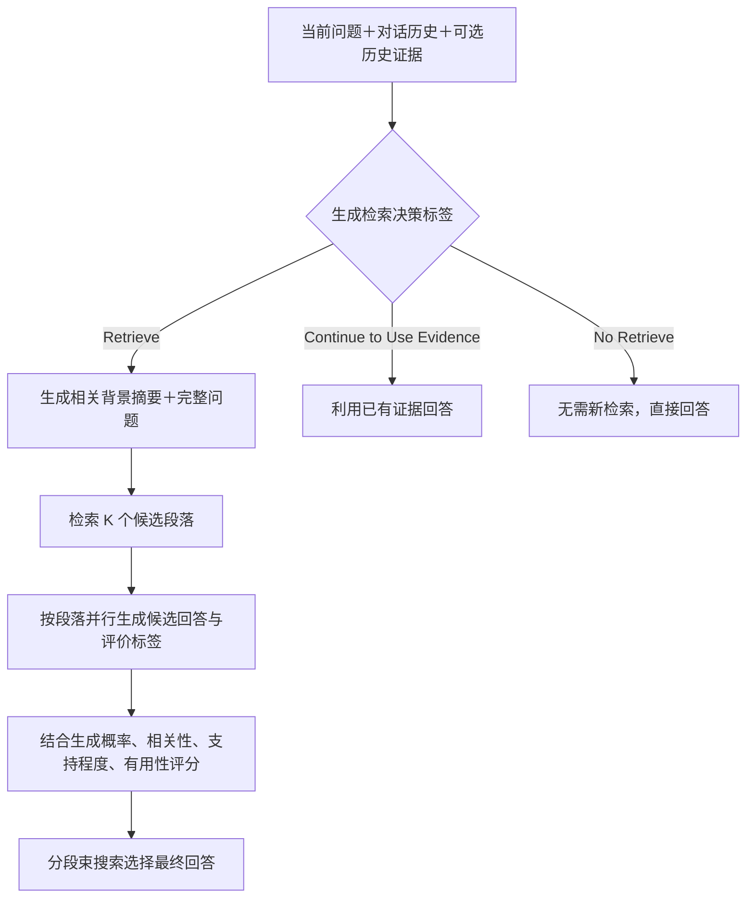

# SELF-multi-RAG：自适应检索与对话摘要改写论文笔记

论文：**Learning When to Retrieve, What to Rewrite, and How to Respond in Conversational QA**  
作者：Nirmal Roy、Leonardo F. R. Ribeiro、Rexhina Blloshmi、Kevin Small  
发表：Findings of EMNLP 2024，10604–10625 页  
来源：[论文主页](https://aclanthology.org/2024.findings-emnlp.622/) · [PDF 全文](https://aclanthology.org/2024.findings-emnlp.622.pdf)

> [!abstract] 核心概要
> 多轮 RAG 应根据当前问题、对话历史和已有证据，决定是否检索新材料；需要检索时，将对话整理成“相关背景摘要＋当前问题”，然后同时评估检索材料的相关性、回答的证据支持程度和回答的有用性。论文提出 SELF-multi-RAG，将这些能力通过训练纳入生成模型，扩展原本面向单轮任务的 SELF-RAG。

本文按原文正文、附录和图表整理。标注使用 **PDF 页码**，对应论文集页码为 PDF 页码＋10603；重要段落提供直接跳转链接。以下标注属于阅读笔记，没有修改原始 PDF。

## 1. 论文究竟想说明什么

论文将多轮问答拆成三个相互影响的问题。

1. **When to retrieve：这轮是否需要检索？** 事实问题未必每次都要重新检索，答案可能已经在历史证据中；创作、解释用户提供的文字等任务也未必需要外部知识。
2. **What to rewrite：拿什么去检索？** 仅输入最后一句会丢失指代和条件；输入全部历史会引入噪声；压成一句独立问题又可能丢失有助于检索的背景。作者选择摘要式查询。
3. **How to respond：如何从证据生成合适回答？** 文档提到了同一实体，并不代表它能回答本轮问题；回答流畅，也不代表证据支持它。系统需要分别判断相关性、支持程度和有用性。

作者希望论证：**让检索决策、查询表示和回答评价都理解多轮上下文，比将对话压平后交给单轮 SELF-RAG 更有效。** 这既是一篇 query rewriting 论文，也是一篇完整的对话式 RAG 方法论文。其训练核心是监督学习和特殊标签预测，不是 DVCQR 式的强化学习。

来源：[引言与贡献，PDF 第 1–2 页](https://aclanthology.org/2024.findings-emnlp.622.pdf#page=1)。

## 2. 问题动机：三个容易混淆的概念

### 2.1 不检索新材料，不等于没有证据

Figure 1 用乐队成员追问说明：第一轮检索的段落可能同时包含成员名单和离队信息。第二轮问谁最先离队时，可以沿用证据，不必重新搜索。

因此系统区分“需要新证据”“不需要事实核验”“已有证据足够”。这里的历史证据应该是系统保存的文档内容，不能简单把以前模型生成的每一句话都当作已验证事实。

### 2.2 查询摘要，不等于普通聊天摘要

Figure 2 中，用户追问网球运动员是否复出。简单改写能补全人名，但可能忽略退休年份、伤病等线索。摘要式查询保留与当前追问相关的背景，再提出完整问题。

其作用是**构造用于检索的文本输入**，不是直接生成答案，也不是把整段聊天尽量详细地复述一遍。更多信息只有在相关且准确时才有帮助。

### 2.3 三类评价不能互相替代

| 评价 | 对象 | 需要回答的问题 |
|---|---|---|
| Relevance，相关性 | 文档与当前对话需求 | 这份材料有助于回答本轮问题吗？ |
| Groundedness，证据支持程度 | 回答与证据／历史 | 回答中的信息能由给定材料支持吗？ |
| Utility，有用性 | 回答与用户需求 | 回答是否完整、有帮助、切题？ |

举例：文档介绍某人的生平，但未提供求学经历，对“他在哪上学”可能不相关；回答严格复述文档，却回避了问题，可能有依据但没有用；回答切题而凭空编造学校名称，则可能看似有用但缺乏支持。

特别注意：**与给定证据一致，不等于现实世界中一定正确。** 如果证据或历史回答本身有错，Groundedness 也不能自动纠正它。

## 3. 方法原理与完整流程

### 3.1 三个组件

| 组件 | 职责 | 本文实现 |
|---|---|---|
| Critic，评价模型 | 为检索决策、文档相关性、回答支持程度和有用性生成监督标签 | 从 Mistral-7B-Instruct-v0.2 初始化并训练 |
| Generator，生成模型 | 学会输出回答和反思标签，并在需要时生成摘要查询 | 同一模型家族初始化；增加摘要训练任务 |
| Retriever，检索器 | 将查询映射到候选段落 | 主流程用经 MS-MARCO 训练的 Contriever；检索对照另含 BM25 |

知识库约有 **5400 万个段落**，来自 QReCC 使用的 Wikipedia 和 Common Crawl 语料。约 1000 万网页与约 5400 万段落是不同粒度，不能混用。

**Critic 主要负责训练数据标注。推理时由已训练的 Generator 自己预测反思标签，不必每次额外调用一个独立 Critic，也不要求在线调用 GPT-4。** 检索器作为外部组件使用，论文没有通过生成模型的损失联合更新检索器。

来源：[§3.1，PDF 第 4 页](https://aclanthology.org/2024.findings-emnlp.622.pdf#page=4)。

### 3.2 推理流程



新检索分支中，不是简单把 K 个段落全部拼接后生成一次。论文描述的是分别处理候选段落、生成候选回答，再结合评分选择输出，并沿用 SELF-RAG 的 segment-level beam search。

| 决策标签 | 含义 | 典型情形 |
|---|---|---|
| `[Retrieve]` | 需要新的外部材料 | 现有材料无法支持当前事实问题 |
| `[No Retrieve]` | 当前内容不需要新的事实核验 | 创作、主观表达或部分常识性内容 |
| `[Continue to Use Evidence]` | 继续使用已有证据／上下文 | 用户给出的文本或前轮证据足以回答 |

本文同时训练二分类 Retrieval 与三分类 Retrieval 两种任务，因此“三个决策标签”不等于全部训练任务只有一个三分类器。附录的三分类标注还会考虑待判断的回答句及其前文，带有生成过程中的证据续用判断。

来源：[§3.2，PDF 第 5 页](https://aclanthology.org/2024.findings-emnlp.622.pdf#page=5)。

### 3.3 摘要式 rewriting 的模板

附录 Table 13 的要求可概括为：将对话历史总结为 **40–50 个英文词的摘要**，并提出一个问题，使摘要与问题脱离原始对话也能支持有意义的回答。注意 words 不等于 tokenizer tokens，也不能直接转换成中文字符数。

下面是依据原文整理的中文理解模板，**不是原文逐字翻译，也不是论文报告的独立新实验**：

```text
输入：对话历史与当前追问。
任务：提取理解当前追问所需的背景，形成简洁摘要，
      再把当前追问表达为能够独立理解的问题。
输出：
Summary: 与当前问题相关的背景摘要
Question: 补全指代和必要条件后的问题
```

原文采用 few-shot 示例演示 Summary / Question 的输出形式。它通过明确任务、长度期望和示例来限定行为，但没有证明长度被严格执行；例如 Table 13 的首个摘要示例就比 40–50 词更长。

这类模板的重点是保留实体、事件、时间和当前问题相关的条件，而不是只替换“他／她／它”。原文没有为摘要单独设计 Critic 任务，而是直接用 GPT-4 生成的摘要样本监督 Generator。

来源：[附录 A，Table 13，PDF 第 17 页](https://aclanthology.org/2024.findings-emnlp.622.pdf#page=17)。

### 3.4 回答如何评分和选择

原文给出的分数形式为：

$$
S=p(y_t\mid x,d,y_{t-1})+w_1S(\mathrm{Relevance})+w_2S(\mathrm{Groundedness})+w_3S(\mathrm{Utility})
$$

其中，\(x\) 是对话历史，\(d\) 是候选段落，\(y_{t-1}\) 表示此前已生成的回答内容。后三项依据反思标签的归一化概率构造，例如期望模型对相关材料给出较高的 Relevant 概率，对有充分依据的回答给出较高的 Fully Supported 概率。权重用于调节选择偏好；论文称沿用 SELF-RAG 的默认值。

这是一种**推理时的候选选择分数**，不是本文的强化学习奖励。Utility 的离散标签虽然为 1–5，但不能直接认定公式在把原始整数与其他概率相加。最终综合分数也不是统一校准的 0–1 正确率。

分段束搜索会保留得分较高的 B 个候选续写，再逐步选择完整序列。它让局部的证据与质量判断参与回答选择，但模型的自评仍可能出错。

## 4. 训练过程：能力是怎样学出来的

1. **GPT-4 标注 Critic 数据。** 从 QReCC 和 UltraChat 抽取对话，标注是否检索、是否沿用证据、相关性、支持程度和有用性，形成 QU-MTC。
2. **构造单轮对照。** 用 T5QR 将同源对话改写为单轮形式，得到 QU-STC；另使用原 SELF-RAG 的单轮数据 STC。
3. **训练 Critic。** 比较只用单轮、只用多轮、混合数据等配置，以检验多轮训练的作用。
4. **Critic 标注 Generator 数据。** 在不同于 Critic 抽样的数据上生成反思标签，把这些标签插入目标回答，得到 QU-MTG；其单轮形式为 QU-STG。
5. **加入摘要任务。** GPT-4 为约 5000 段对话生成摘要，构成 CSD。Generator 用 next-token prediction 同时学习带标签的回答和摘要任务。

| 缩写 | 含义与用途 |
|---|---|
| QU | QReCC 与 UltraChat 两种数据来源 |
| ST / MT | Single-turn / Multi-turn，单轮／多轮表示 |
| C / G | Critic / Generator，对应训练数据用途 |
| STC | 原 SELF-RAG 的单轮 Critic 数据 |
| QU-MTC / QU-STC | 同源多轮／单轮 Critic 数据 |
| QU-MTG / QU-STG | 多轮／单轮 Generator 数据 |
| CSD | Conversation Summarization Data，对话摘要训练数据 |
| SFT | Supervised Fine-Tuning，监督微调 |

Table 1 中新增 Critic 各任务的数据量分别为 232、210、301、259、269 个实例；这些数值不能当成整个 Generator 的训练样本量。

Table 3 中重要对照：Critic_s 使用 STC＋QU-STC，Critic_sm 使用 STC＋QU-MTC；SELF-RAG_s 使用单轮 Generator 数据，SELF-multi-RAG 使用 QU-MTG＋CSD。前者能帮助控制数据来源，但最终系统比较仍同时涉及对话表示、Critic 和摘要能力等差异，不能把全部收益只归于某一个模板。

论文所谓“from scratch”同时明确使用 Mistral 指令模型作为初始 checkpoint，应理解为从该 checkpoint 重新训练实验模型，**不是随机初始化训练一个 7B 基座**。附录 C 报告 Critic 训练 3 epochs、Generator 2 epochs，两者学习率均为 2e-5。

来源：[§4.1–4.2、Tables 1–3，PDF 第 4–6 页](https://aclanthology.org/2024.findings-emnlp.622.pdf#page=6)；[附录 C，第 11 页](https://aclanthology.org/2024.findings-emnlp.622.pdf#page=11)。

## 5. 实验在验证什么

### 5.1 数据集的分工

| 数据集 | 特征 | 本文验证用途 |
|---|---|---|
| QReCC | 有上下文依赖的事实问答，提供相关段落标注 | 检索召回、事实问答、历史证据复用 |
| UltraChat | 多样化指令对话，并非每轮都需要外部知识 | 判断什么时候不必检索，以及一般对话质量 |
| MT-Eval | 多轮指令能力评测；未用于本文训练数据采样 | 域外多轮评估，但不是所有未知领域的保证 |

主流程采用 Contriever 稠密检索；Table 5 额外测试 BM25 稀疏词项检索。T5QR 是对话问题改写基线；Gold Rewrite 是人工改写，并非金标准答案段落；GPT-4 Summary 是强教师产生的摘要，不应误写为人工摘要。

### 5.2 指标、区间和解释

| 指标／分数 | 区间 | 衡量什么 | 适合用途及边界 |
|---|---|---|---|
| Critic Accuracy | 0–1 | 反思标签预测与参考标签一致的比例 | 分析决策能力；这里主要与 GPT-4 标签比较，不是绝对真理 |
| R@5、R@10 | 0–1，或乘 100 展示为百分比 | 前 K 个结果找回相关材料的程度 | 检查候选证据是否被召回；不区分前 K 内的精细位置 |
| BERTScore | 取决于实现及是否重缩放；本文数值在 0–1 内 | 基于上下文词向量比较回答与参考答案的语义相似性 | 比字面匹配灵活，但不等于事实正确率；不能认为所有配置理论上严格限于 0–1 |
| UniEval Coherence | 通常归一化为 0–1 | 回答与上下文的连贯性 | 自动评估对话衔接；不保证事实正确 |
| UniEval Groundedness | 通常归一化为 0–1 | 回答对证据的依赖／支持程度 | 检查有据程度；受证据与评价模型影响 |
| Utility 标签 | 1–5 | 模型训练中的回答有用性等级 | 用于反思学习；与人工总分不是同一项 |
| Human | 1–5 | 人工评估连贯性、吸引力、可理解性 | 更接近部分交互体验；不是专门的事实核验分数 |
| GPT-4 评分 | 正文称 1–5，附录模板明确写 0–5 | 模型作为评审的综合质量评分 | 原文定义不一致，应保留说明，不能直接当百分比 |
| Ret.? | 0%–100% | 发生新检索的实例比例 | 衡量检索频率，越低不一定越好；不是端到端费用或延迟 |

一般 Recall@K 可写为“前 K 项中相关材料数／全部已标注相关材料数”，再对查询求平均；若每题只有一个目标段落，就等价于 Top-K 是否命中的均值。论文没有在正文详细交代多 gold 情形的聚合实现，复现时应核查。

**本文没有报告 NDCG@10。** NDCG 关注排序位置与相关等级，而 R@10 主要关注前十项有没有召回所需材料，两者不能混用。NDCG 详解见 [[AI Reference/Query Rewriting：Elastic 文章笔记与检索评估指标]]。

### 5.3 回答质量：整体改善，但不能说每项都优于所有基线

下表摘录 Table 4；SELF-RAG_s 是使用同源数据、单轮表示的对照。

| 数据集 | 模型 | GPT-4 | BERTScore | Groundedness | Human |
|---|---|---:|---:|---:|---:|
| QReCC | SELF-RAG_s | 1.51 | 0.75 | 0.78 | 3.71 |
| QReCC | SELF-multi-RAG | 4.15 | 0.80 | 0.87 | 4.20 |
| UltraChat | SELF-RAG_s | 1.45 | 0.75 | 0.95 | 4.05 |
| UltraChat | SELF-multi-RAG | 2.70 | 0.78 | 0.99 | 4.46 |
| MT-Eval | SELF-RAG_s | 1.20 | 0.72 | 0.80 | 4.01 |
| MT-Eval | SELF-multi-RAG | 3.12 | 0.74 | 0.92 | 4.23 |

相对于原始 SELF-RAG，三个数据集 Human 分别从 3.50→4.20、4.00→4.46、3.84→4.23。作者将人工提升概括为约 13%；它不是回答正确率提高 13 个百分点，也不应套用到所有基线。使用表中舍入值计算，三个相对提升平均约 13.9%；改与 SELF-RAG_s 比，约为 9.6%。

QReCC 上不检索的 Mistral 基线 Coherence 为 0.98，SELF-multi-RAG 为 0.97。因此“所有指标都优于所有模型”不成立。另外，Table 4 的 Groundedness 只在模型决定检索的案例上计算，不同模型参与计算的样本集合可能不同。

来源：[Table 4 与脚注，PDF 第 7 页](https://aclanthology.org/2024.findings-emnlp.622.pdf#page=7)。

### 5.4 摘要查询：比本文测试的短问题改写更有效

| 查询表示 | BM25 R@5 | BM25 R@10 | Contriever R@5 | Contriever R@10 |
|---|---:|---:|---:|---:|
| 完整对话 | 0.50 | 0.58 | 0.53 | 0.61 |
| 人工改写 | 0.50 | 0.61 | 0.58 | 0.69 |
| T5QR 改写 | 0.45 | 0.55 | 0.53 | 0.64 |
| SELF-multi-RAG 摘要 | 0.56 | 0.66 | 0.61 | 0.71 |
| GPT-4 摘要 | 0.60 | 0.70 | 0.62 | 0.72 |

这说明在该 QReCC 实验中，保留有用背景的摘要能改善稀疏和稠密检索；也说明学生摘要尚未全面达到 GPT-4 摘要表现。

例如 BM25 R@5 从 T5QR 的 0.45 到 0.56，是增加 0.11，即 **11 个百分点**，相对提高约 **24.4%**。相比人工改写的 0.50，则相对提高 12%。引言提到的平均 13.5% 未在表内明确给出可直接对应的唯一基线与平均口径，引用时宜优先报告这些具体对照。

Table 6 固定 SELF-multi-RAG、改变检索查询表示，也支持摘要有益：QReCC 的 GPT-4 评分从完整对话查询的 3.75、T5QR 查询的 3.52，提高到摘要查询的 4.15。但这不能推出任意摘要都优于任意改写器，更不能推出查询越长越好。

来源：[§5.1、Table 5，PDF 第 8 页](https://aclanthology.org/2024.findings-emnlp.622.pdf#page=8)；[Table 6，第 9 页](https://aclanthology.org/2024.findings-emnlp.622.pdf#page=9)。

### 5.5 复用历史证据：减少检索，但存在质量取舍

Table 7 中 SELF-multi-RAG 的结果：

| 数据集 | 是否输入历史证据 | 新检索比例 | Groundedness | BERTScore |
|---|---|---:|---:|---:|
| QReCC | 否 | 98% | 0.87 | 0.80 |
| QReCC | 是 | 54% | 0.79 | 0.78 |
| UltraChat | 否 | 62% | 0.99 | 0.78 |
| UltraChat | 是 | 37% | 0.97 | 0.75 |
| MT-Eval | 否 | 58% | 0.92 | 0.74 |
| MT-Eval | 是 | 40% | 0.90 | 0.73 |

QReCC 新检索率下降 **44 个百分点**，相对减少约 **44.9%**，但两项质量分数也下降。应将它理解为一种可调节的取舍，而不是“少检索且完全不损失质量”。

还要注意：§5.2 对 QReCC 历史证据任务明确使用前轮 **ground-truth passages**。这比真实服务里带有误召回的历史证据更理想，不能直接保证真实缓存场景会获得同样收益。少检索还可能伴随更长的历史输入、摘要生成和多候选处理，论文没有据此证明总费用或端到端延迟下降同样比例。

来源：[§5.2，第 8 页](https://aclanthology.org/2024.findings-emnlp.622.pdf#page=8)；[Table 7，第 9 页](https://aclanthology.org/2024.findings-emnlp.622.pdf#page=9)。

## 6. 各章节与段落群的大意

| 部分 | 内容推进 | 阅读时应抓住的重点 |
|---|---|---|
| Abstract | 从多轮 RAG 的上下文困难引出方法与结果 | 三个动作：检索决策、摘要查询、自我评价 |
| §1 前半，Figure 1 | 无差别检索会加入噪声；已有证据可能足够 | 事实问答不等于每轮都要检索 |
| §1 后半，Figure 2 | 单句改写可能丢失检索线索，提出两项核心能力 | 摘要保留背景，多轮训练理解上下文 |
| §2 Related Work | 回顾 RAG、多轮模型、对话改写 | 本文同时考虑是否检索及最终回答，而非只优化查询 |
| §3 开头 | 定义多轮理解与对话摘要两个方向 | 与单轮 SELF-RAG 的主要差异 |
| §3.1 | 解释 Critic、Generator、Retriever | 训练标注与线上执行要分清 |
| §3.2 | 三种检索行为、候选回答及评分搜索 | 完整执行链路 |
| §4 与 §4.1 | 三种数据集与训练样本构造 | 同源单轮对照、GPT-4 标签来源 |
| §4.2 | 配置 Critic 和 Generator 的对照模型 | 不同模型名背后的训练数据差异 |
| §4.3 | 自动指标和人工评价流程 | 人工评估三个维度，不等于专门的事实核验 |
| §5 开头 | Critic 准确率和回答质量结果 | 多轮训练有益；域外数据也有提升 |
| §5.1 | 改变查询表示，比较召回和回答质量 | 摘要是收益来源之一 |
| §5.2 | 对比是否提供前轮材料 | 证据复用的检索频率与质量取舍 |
| §6 | 总结，提出长对话、多线程与证据多样性方向 | 这些方向尚未被本文充分解决 |
| §7 | 英文、单模型家族、离线检索等限制 | 不应当作成熟线上系统的性能证明 |
| 附录 A，Tables 8–13 | 各反思任务与摘要的 GPT-4 标注模板 | 模板是训练数据生产的重要环节 |
| 附录 B，Table 14 | 数据集长度与具体对话差异 | 三种 benchmark 不能视为相同难度 |
| 附录 C | 训练参数与 BERTScore 编码器 | 可复现性信息 |
| 附录 D，Table 15 | GPT-4 评审模板 | 评分范围与正文不一致 |
| 附录 E，Table 16、Figure 5 | 人工评审条件、分项结果、界面 | 了解 Human 分数实际衡量什么 |
| 附录 F，Table 17 | 指代理解和用户已给材料的回答案例 | 展示机制，不能代替系统性评估 |

## 7. 重要段落标注与精读顺序

以下为意译提要，不是原文直接引语。⭐ 为必读，○ 为深入实现或核验时阅读。

| 标记 | 原文位置与链接 | 重要内容／建议批注 |
|---|---|---|
| ⭐ | [第 1 页 Figure 1 及引言末段](https://aclanthology.org/2024.findings-emnlp.622.pdf#page=1) | “已有证据可能已包含下一轮答案”；理解为什么需要检索决策 |
| ⭐ | [第 2 页 Figure 2 与摘要动机段](https://aclanthology.org/2024.findings-emnlp.622.pdf#page=2) | “独立问题可能丢失背景”；理解摘要式 rewriting 的目的 |
| ⭐ | [第 3–4 页 §3 两个功能段](https://aclanthology.org/2024.findings-emnlp.622.pdf#page=3) | 区分上下文理解和查询摘要两个贡献 |
| ⭐ | [第 4 页 Figure 3、§3.1 Generator 段](https://aclanthology.org/2024.findings-emnlp.622.pdf#page=4) | Critic 生成训练标签，Generator 学会预测；摘要不另设 Critic |
| ⭐ | [第 5 页 §3.2 前两段](https://aclanthology.org/2024.findings-emnlp.622.pdf#page=5) | 三种检索行为与 K 个候选的处理方式 |
| ⭐ | [第 5 页评分公式及下方解释](https://aclanthology.org/2024.findings-emnlp.622.pdf#page=5) | 生成概率与自评概率共同参与选择；不是 RL 奖励 |
| ○ | [第 6 页 §4.1–4.2、Table 3](https://aclanthology.org/2024.findings-emnlp.622.pdf#page=6) | 对照组的训练数据组成；避免错认公平对照 |
| ⭐ | [第 7 页 Table 4 及脚注](https://aclanthology.org/2024.findings-emnlp.622.pdf#page=7) | 回答质量证据；Groundedness 的条件子集限制 |
| ⭐ | [第 8 页 §5.1、Table 5](https://aclanthology.org/2024.findings-emnlp.622.pdf#page=8) | 改写、完整历史、摘要的直接检索比较 |
| ⭐ | [第 8 页 §5.2 第一段至第 9 页 Table 7](https://aclanthology.org/2024.findings-emnlp.622.pdf#page=8) | 历史证据实验、gold passage 设置与质量取舍 |
| ⭐ | [第 9 页 §7 Limitations](https://aclanthology.org/2024.findings-emnlp.622.pdf#page=9) | 英文实验、模型范围和离线检索限制 |
| ○ | [第 12–16 页 Tables 8–12](https://aclanthology.org/2024.findings-emnlp.622.pdf#page=12) | 五类标注模板，尤其区分相关性、支持度、有用性 |
| ⭐ | [第 17 页 Table 13](https://aclanthology.org/2024.findings-emnlp.622.pdf#page=17) | 40–50 words 的摘要要求与 Summary / Question 示例 |
| ○ | [第 20 页 Tables 15–16](https://aclanthology.org/2024.findings-emnlp.622.pdf#page=20) | 核验 GPT-4 评分区间和人工分项 |
| ○ | [第 21 页 Table 17](https://aclanthology.org/2024.findings-emnlp.622.pdf#page=21) | 实例化理解指代与已有材料利用 |
| ○ | [第 22 页 Figure 5](https://aclanthology.org/2024.findings-emnlp.622.pdf#page=22) | 人工评审界面；连贯、吸引力、可理解性均为 1–5 |

如果只精读五处：**Figure 3 → §3.2 → Table 13 → Table 5 → Table 7 与 Limitations**。

## 8. 原文疑点与结论边界

1. **效率段落存在疑似笔误。** 第 9 页 §5.2 接续段把偏向质量、偏向效率两种配置都写成 Ret. w/o P.。根据 Table 7，第二处应当指 w P. 才符合数据；这是根据表格作出的解释，非作者公布的勘误。
2. **GPT-4 评分范围不一致。** §4.3 写 1–5，Table 15 实际模板写 0–5。笔记保留两者，不擅自统一成某一范围。
3. **人工总分和分项存在无法直接复算的情况。** §4.3 称三维度均值为总分，但例如 UltraChat 的 SELF-multi-RAG 在 Table 16 为 4.81、3.20、4.85，简单均值约 4.29，Table 4 却为 4.46；QReCC 对应分项均值约 4.17，表中为 4.20。可能涉及未说明的聚合差异或表格错误，原文没有给出足够信息判定原因。因此“约 13%”应作为作者报告而非精确可复算的普适收益。
4. **反思标签命名不完全一致。** 正文出现 Retrieve / Non Relevant，附录标注模板出现 Retrieval / Irrelevant 等写法。理解概念即可；实现时需要统一映射，不能直接把所有示例字符串当作同一套 tokenizer 特殊 token。
5. **监督标签来自 GPT-4。** Critic 标签准确率主要衡量与教师的一致性，不能直接声称是“正确判断是否需要检索”的客观上限；摘要和评审也依赖 GPT-4，需考虑共同偏差。
6. **不能证明无限长历史有效。** Figure 4 的轮数分析到 6 轮，更长与多线程对话被作者列为未来方向。
7. **线上效率未被充分验证。** 作者明确使用离线检索降低实验开销，未给出完整实时系统的端到端成本验证。少检索是有价值的观察，但不等于部署后的总 token 或延迟必然同比减少。
8. **检索失败仍会限制回答。** 作者承认找不到相关文档时仍可能无法给出满意回答；自我评价并未消除幻觉，也未提供对证据时效、冲突和错误历史的完整解决方案。
9. **泛化范围有限。** 实验为英文，Critic 与 Generator 使用一个模型家族；BM25 的检索对照不代表整套生成流程已在多种检索器上完成系统验证。没有足够证据把改善直接推广到中文或专业领域。

## 9. 与已有笔记的关系及实际启发

| 方法 | 主要优化对象 | 与本文的关系 |
|---|---|---|
| Elastic Query Rewriting | 用模板指导 LLM 生成检索文本或结构化查询 | 本文进一步训练“何时检索”与回答自评 |
| CHIQ | 先增强对话历史，再生成更有效的独立查询 | 都重视历史信息；本文把查询表示扩展为摘要，并评估生成答案 |
| DVCQR | 稀疏／稠密双视图查询与分阶段强化学习 | 本文没有双视图和相应 RL，重点在自适应检索与对话问答整体 |
| SELF-multi-RAG | 检索决策、摘要查询、证据及回答评价 | 将 rewriting 放在完整的多轮 RAG 决策链中 |

可迁移的工程思路是：保留可追溯的历史证据；区分“无需证据”和“已有证据足够”；用围绕当前问题的摘要查询替代机械拼接全部历史；分别评估召回、回答质量和调用成本。

这些属于由论文推导的实施建议，并非已经被本文验证的通用最佳实践。如果直接用现有 LLM 提示词实现相同流程，应称为受论文启发的实现；仅复制模板并不等于复现其 Critic 标注、Generator 训练及反思标签搜索机制。

相关笔记：

- [[AI Reference/Query Rewriting：Elastic 文章笔记与检索评估指标]]
- [[AI Reference/CHIQ：对话历史增强与查询改写论文笔记]]
- [[AI Reference/DVCQR：双视图查询改写与分阶段强化学习论文笔记]]
